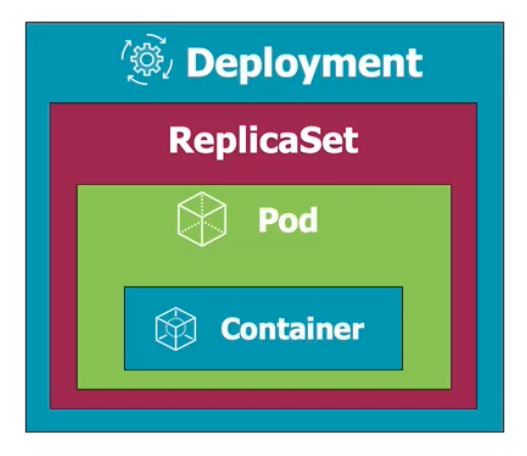

### Creating a deployment

Deployment is a wrapper on top of replicaset, which is a wrapper on top of pod, which is a wrapper on top of container.




```
kubectl create -f deployment.yaml --save-config
```

Using `--save-config` so that we could use the `kubectl apply` henceforth to update the deployment params.

#### Check the updates to pods

```
kubectl get all
```

#### Check the details of the deployment

```
kubectl describe deployment.apps/nginx
```

Note: The deployment id is picked from the `get all` command output.
